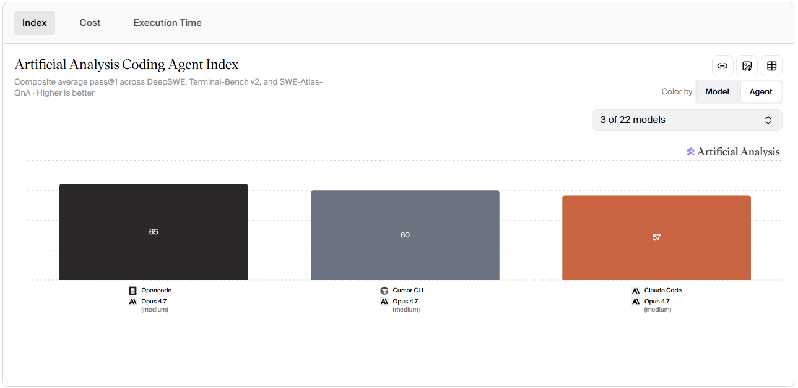
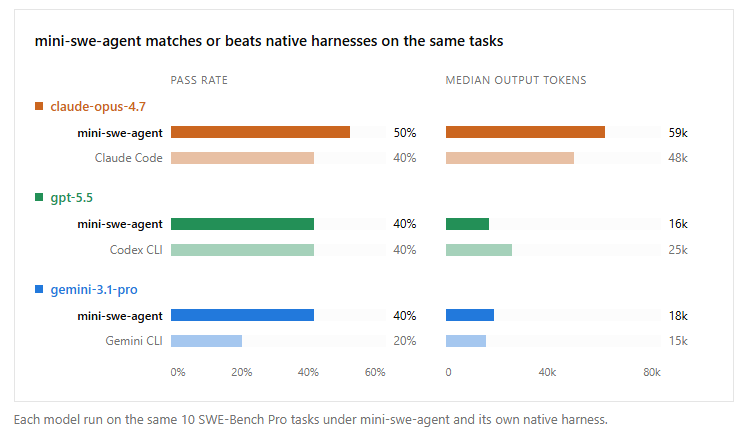
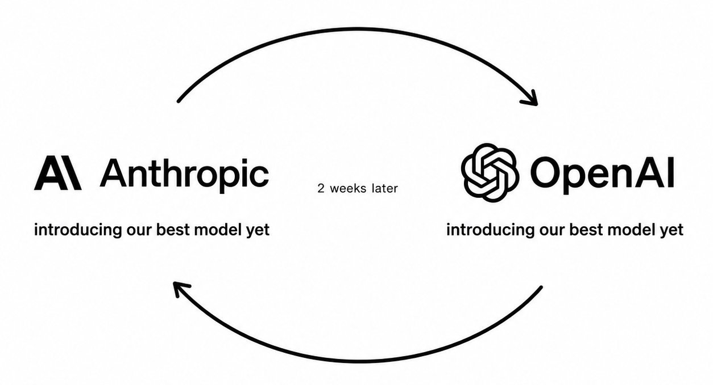
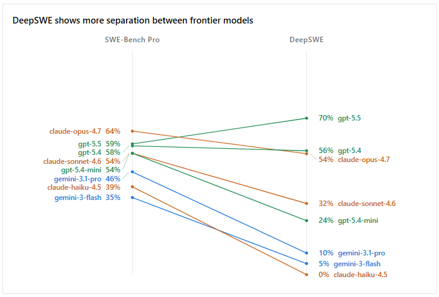
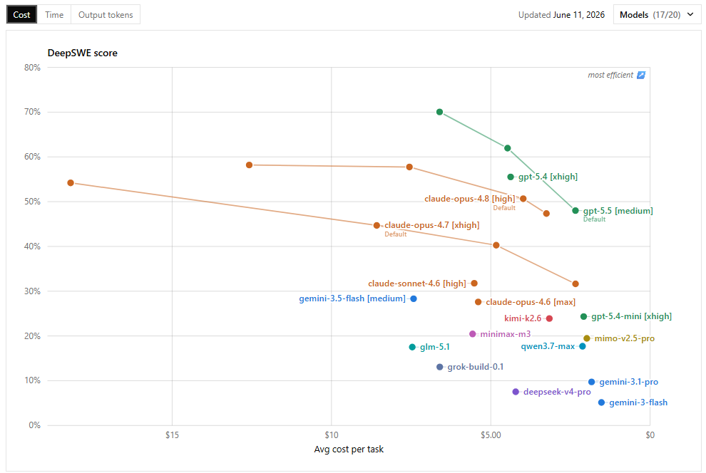
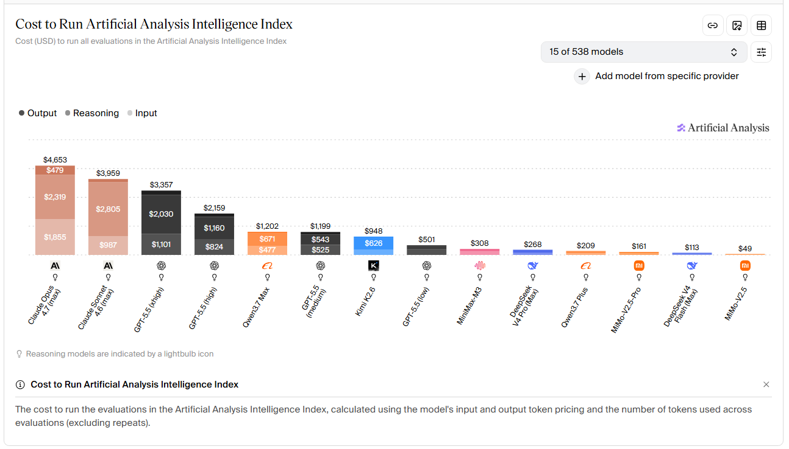
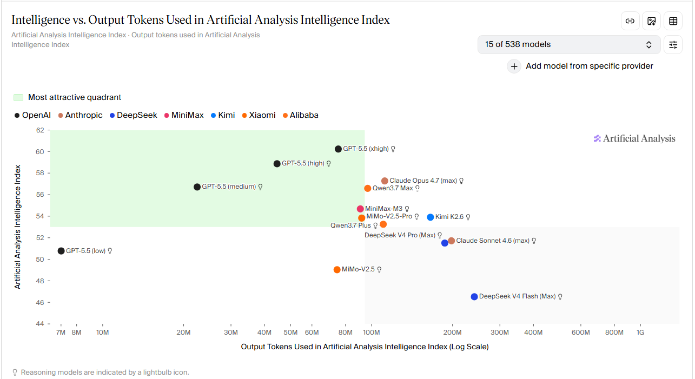
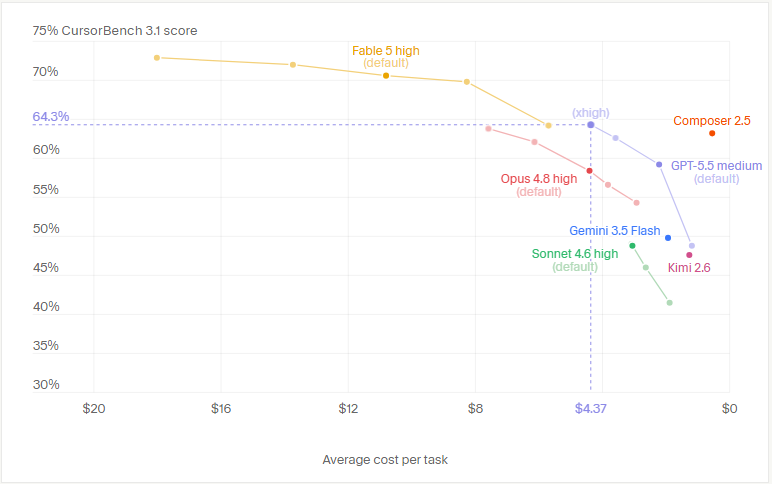

As of 14th June 2026, there's a lot of Coding Models, Harnesses and Subscriptions to pick from so this is a rundown of some of my opinions on all of them. This will probably change month to month but some of these choices have persisted for some months now.

---

## Harnesses

I have tried many harnesses personally like some of these :

- Cursor
- Claude Code
- Codex
- Antigravity
- Kilo
- MimoCode
- Kiro
- OpenCode

Earlier this year I did a [KiloCode vs ClaudeCode test](https://github.com/MAiKo26/testing-cc-v-kc) and the results were pretty much all in favor of Kilo Code not because it's so much better but because Claude Code is that much worse. From all Benchmarks publicaly available Claude Code as a Harness actively makes Claude's models perform worse.

So that's Claude Code, even from the [leaked source code](https://ccunpacked.dev/) it did look like a Vibe Coded mess and it actively hurts it's own models if anything not enhance them.

So next we have Kiro from Amazon and Antigravity from Google and neither offer anything special (haven't tried Microsoft's Copilot much) and same goes for Kilo/MimoCode which are OpenCode forks.

So at the end the current best Harnesses in my opinion are Cursor, Codex and OpenCode; Cursor especially ever since AI Coding took off it hasn't lost the number one spot in my opinion as it has consistently been the best Harness to use wheter in CLI, Cloud, Agents interface or VSCode Fork Interface.

## Models

For Coding Purposes at SOTA, realistically it's only been Anthropic's Opus vs OpenAI's GPT but past that there's always a bit of nuance that recent DeepSWE benchmarks has shown.

First of all not all benchmarks are created equal and SWE-Bench is greatly flawed and boosts a lot of models because no one that has used Haiku for real coding use cases would tell you it's half as good as the latest Opus yet that's what SWE-Bench claim and that's just false and DeepSWE prove that and in that same DeepSWE it shows GPT-5.5's edge over Opus

From what I understood using both GPT and Opus is that GPT is much more thorough and overall the better coding model but Opus edges it out for Frontend design and taste but even that you could probably steer GPT towards the design you want and there are ton of Frontend design Skills that help out in this case.

Second point is efficiency, cost effeciency is masively in favor of GPT models because they generate much less tokens for same tasks and this is how Claude ends up eating more money compare to GPT. For example in DeepSWE Benchmark, for over 10% difference in favor of GPT (70%) it still did it for half the price Claude (58%) from 7$ to 13$. This adds up insanely over time so you are paying for a worse model both in cost and in performance. And while Anthropic will probably release a smarter model (e.g Fable or next gen Opus), you can safely assume GPT will respond in kind few weeks after.

So in terms of SOTA, it's GPT > Claude but past that there are a lot of options because you don't need a Ferrari to go to a 2min away grocery store. Most coding is trivial tasks or even big tasks can be split into smaller ones and done by much much more cost efficient models and this is where Open Weight chinese models become extremely competitive cause GPT's mini series and Claude's Haiku or Sonnet are not competitive at all in this aspect.

But before touching on those models got to address that I believe Gemini, Grok, Muse or any other US Big Tech Model has never been a good coding option; especially Gemini which scores high in benchmarks but it's awful for any real usage cause it fails even basic tool calling.

So with that said which cost efficient models do I like ? I tried these the most

- Composer 2.5
- GLM-5.x
- Deepseek V4 Flash/Pro
- Minimax-M3
- Mimo-V2.5
- Kimi K2.6
- Qwen 3.7 Max

I think all of them have great usage and depending on the latest release of these labs they probably take the lead but the ones I settled on are Composer 2.5, Mimo V2.5 (not pro) and Deepseek V4 Flash.

Composer 2.5 is just absurdly good for the price it offers and performance for coding purposes only it's just by far the most cost efficient coding model; the other models try to be general purpose and do a bit of everything but Composer just focuses and Coding and while the benchmarks for Composer are also a bit faulty imo because even with how good it is it's not as good as Opus or GPT on high or even on medium sometimes but it's almost there for 90% of coding tasks

After that Mimo V2.5 and Deepseek V4 Flash are absurdly cheap, I'm still not sure which one is actually better I keep flip flopping but they are my 2 favorite open weight models right now which I use for all the "easy" grunt work and research.

So these are the models I'm using for each category:

- GPT-5.5 for hardest tasks
- Composer 2.5 for daily driver
- Mimo V2.5/Deepseek V4 Flash for everything else

## Subscriptions

Once you go past Harness and Model, the next (and probably most important right now) variable is the subscription type and it's only important cause of the absurd subsidation some of these Labs include. So with that said despite Claude Code's drawbacks and Anthropic models inefficiency, it goes back to top of the list in this category due to the subsidations.

So in short GPT and Claude Plans can get you with 200$ up to 2000$-5000$ that's obviously not sustainable for the future but it is what they currently offer and it's absurd not to use it.

After that Cursor, I have 20$ plan and with it in the last 6 months I have done

| Billing Period          | Included Cost |    Total Tokens |
| ----------------------- | ------------: | --------------: |
| 2026-01-07 → 2026-02-06 |    **$80.08** | **120,155,318** |
| 2026-02-07 → 2026-03-06 |    **$70.77** | **106,633,557** |
| 2026-03-07 → 2026-04-06 |    **$87.89** | **148,867,677** |
| 2026-04-07 → 2026-05-06 |    **$80.78** | **171,676,921** |
| 2026-05-07 → 2026-06-06 |    **$47.10** | **297,628,837** |
| 2026-06-07 → 2026-06-12 |    **$20.16** |  **37,239,501** |

| Billing Period          | Included Cost | Estimated Free Usage Value | Estimated Total |
| ----------------------- | ------------: | -------------------------: | --------------: |
| 2026-01-07 → 2026-02-06 |    **$80.08** |                 **$10.68** |      **$90.76** |
| 2026-02-07 → 2026-03-06 |    **$70.77** |                  **$0.68** |      **$71.45** |
| 2026-03-07 → 2026-04-06 |    **$87.89** |                  **$2.25** |      **$90.14** |
| 2026-04-07 → 2026-05-06 |    **$80.78** |                 **$21.03** |     **$101.81** |
| 2026-05-07 → 2026-06-06 |    **$47.10** |                 **$49.78** |      **$96.88** |
| 2026-06-07 → 2026-06-12 |    **$20.16** |                  **$0.00** |      **$20.16** |

So you are getting 4x to 5x and this is only got better after the release of Composer 2.5 as it became alongside Auto marked as "Free" after certain Included usage (that's why May Included Cost went down) but also Composer 2.5 in Free mode becomes slower so that's a factor too. So for 20$ you get about 4x the value initially then you can only use Auto or Composer 2.5 (which what I was using anyway) on slow mode.

And past that for Open Weight models Deepseek V4 Flash and Mimo V2.5 are so cheap they are practically (and actually on OpenCode) free but even if they were to change that in the future OpenCode Go which's 10$ sub that give you monthly limit of 60$ is more than enough to get unlimited usage of these 2 models and a decent amount of other near SOTA open weight models like Minimax M3 or Kimi 2.7 Code released recently.

| Total Params | Active Params | FP16         | Q8           |
| ------------ | ------------- | ------------ | ------------ |
| 310B         | 15B           | ~620 GB VRAM | ~310 GB VRAM |
| 284B         | 13B           | ~568 GB VRAM | ~284 GB VRAM |

Self-hosting is an option too for these models if you can afford it, DS4 is 284B params and MimoV2.5 is 310B but the costs of electricity and buying the hardware can never really be worth it for an individual so unless a company is self-hosting it for multiple workers, it's not worth it and the API of these is already absurdly cheap.

## What I would chose right now ?

While GPT and Claude plans lock you in their ecosystem with big subsidation (Claude quite literally as they even banned claude -p recetly and want you to use Claude Code CLI as much as possible) ; Cursor and OpenCode allow you to explore all available models, OpenCode more so as you can get any Provider and add it and pay as you go with Zen or Kimi subscriptions etc while Cursor allow you to chose between the main US Big Tech Providers GPT/Claude/Gemini/Grok etc

But it's a tradeoff cause GPT/Claude offer you SOTA models that can work on the hardest possible tasks, so if you feel like you really need this you probably should pick one of these (picking both is overkill for no reason).

- Ideally Cursor 60$ + GPT 100$ + OpenCode Go 10$ (Maybe even self host DS4 or MimoV2.5 but that require even more initial cost)
- If I had a limited budget Cursor 20$ + OpenCode Go 10$
- If I had to pick one Cursor 60$

If I had to rank them currently :

1. Cursor
2. OpenCode Go
3. GPT Codex
4. Claude Code

Anything else isn't as good of an option as of right now.

## Sources

**Benchmarks & Evaluations**

- [DeepSWE Benchmark Results](https://deepswe.datacurve.ai/blog#results)
- [Artificial Analysis Intelligence Index](https://artificialanalysis.ai/?models=gpt-5-5-medium%2Cgpt-5-5-high%2Cgpt-5-5-low%2Cgpt-5-5%2Cclaude-sonnet-4-6-adaptive%2Cclaude-opus-4-7%2Cdeepseek-v4-pro%2Cdeepseek-v4-flash%2Cminimax-m3%2Ckimi-k2-6%2Cmimo-v2-5-pro%2Cmimo-v2-5-0424%2Cglm-5-1%2Cqwen3-7-plus%2Cqwen3-7-max&intelligence-category=country-analysis)
- [Cursor Evals](https://cursor.com/evals)

**Pricing & Subscriptions**

- [Cursor Pricing](https://cursor.com/pricing)
- [OpenCode Go](https://opencode.ai/go)
- [ChatGPT Pricing](https://chatgpt.com/pricing)
- [Claude Pricing](https://claude.com/pricing)
