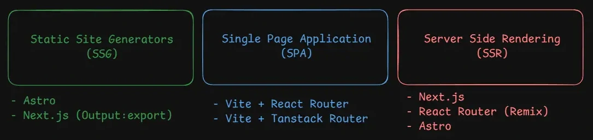

# create-react-app is Deprecated, What are the modern alternatives?

On February 14th 2025, React Dev team finally announced that create-react-app is getting deprecated in this article : [Sunsetting Create React App – React](https://react.dev/blog/2025/02/14/sunsetting-create-react-app)

## The Legacy of Create React App

A bit of history, create-react-app came out in 2016 by the React team in Facebook to facilitate bootstrapping a React app the easiest way because before this getting pieces together was hard as you had to configure Webpack, Babel, eslint and other build tools just to get working and have things that we take for granted now as basic like hot reload, that was revolutionnary back in the day thanks to create-react-app.
And made it easier for new commers to get going without thinking too much about build tools.

## Why Create React App Fell Out of Favor

Fast forward around 2019-2021, create-react-app kinda became on life-support kinda like Express.js right now where it's clearly not the best way to start a react application but still the majority of people used it since many tutorials defaulted to it.
But even back then in the React docs, it was always recommended to use a "Meta Framework" around React instead of CRA like Next.js, Remix, Gatsby etc ...

CRA is reliant on Webpack which compared to modern tools is really slow for Build & Dev performance and it was tightly coupled too so you had to "eject" configs which was notoriously hard and limited customization. While at the same time, Facebook's React team kinda abandoned CRA and as I mentioned earlier joined Next.js' team on Vercel to build a complete Framework experience around React the library.

## Modern Alternatives to Create React App

And now onto the present, many tools came as powerhouses in the space but none compared to Vite. it is **THE** standard build tool in Web right now and for good reason. it blows Webpack out of the park for performance and almost every tool that you use is probably built ontop of Vite and it is the most straightforward drop-in alternative to create-react-app (I would also recommend using pnpm instead of npm but that's a different topic).

```
$ npm create vite@latest
```

Vite is used in almost every framework like Vue, Svelte, Solid, Astro, Qwik, Angular and React. Out of all the tools in this article only one doesn't use Vite it's Next.js and that's because Next.js are building their own Webpack compatible build tool called ["Turbopack"](https://areweturboyet.com/) in Rust with far better performance and hopefully will be the replacement for Webpack in the future.

So, what are all the alternatives to CRA right now and what are the broad uses cases? These are my recommendation based on my personal experience.

First you gotta understand that there are 3 general use cases for any Web App (SSG, SPA, SSR) we won't dive too deep into them right now maybe I will do another article later but I will give an example for each :



### SSG (Static Site Generation)

The most common websites out there are static but you wouldn't associate React with it as it seem like it's something more like Wordpress.
For this I would personally recommend Astro and Next.js but with a slight advantage for Astro as it was built for content websites and it optimizes everything around 0-Javascript idea so the page loads as fast as possible and most importantly for SSG you don't need a node/bun/deno server running as it transpile to HTML/CSS/JS output.

### SPA (Single Page Application)

This is exactly what CRA used to do and as I said earlier Vite is the drop-in replacement for it ... these kind of apps are like Dashboard and heavy interactivity client apps that don't need SEO or static content etc.
Coupled with Vite you can choose a Router just like you used to do with CRA and I would recommend either the current standard React Router (Former Remix team) or Tanstack Router (great library author).

### SSR (Server Side Rendering)

These are the new kind of apps that are being pushed forward and recommended by the industry ([Chrome Team Recommending Rendering on the Web | Articles | web.dev](https://web.dev/articles/rendering-on-the-web)).
And the ones pioneering this right now are Next.js as it does a Hybrid of things and has many benefits and some examples of SSR pages that need the SEO + Performance + Interactivity but that comes at the cost that you need a powerful running server to handle the requests as pages are rendered on the server before sent to the client (as opposed to SPA where the client does everything).

## Conclusion

And that should sum it up, 2025 onward should be exciting. I have tried Next.js, Astro and Vite and they are the clear best options in my opinion to start your next React App but if I were to choose a default that does a Hybrid of everything then Next.js is the winner.
