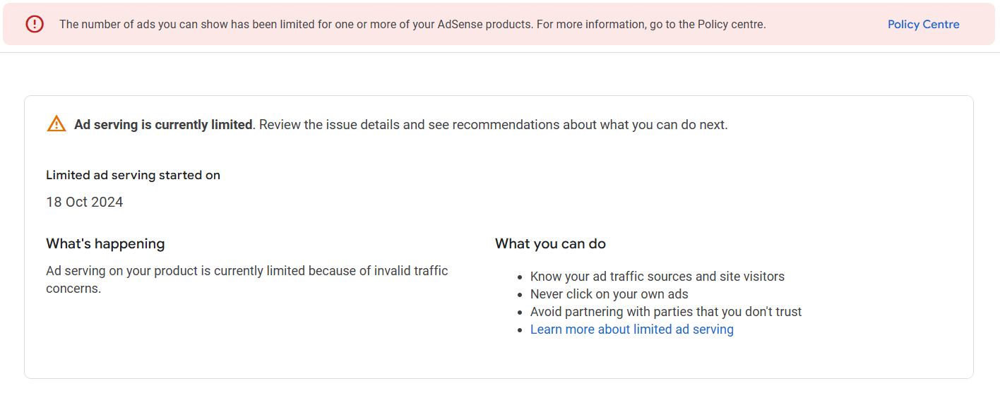

If you're a Google AdSense user, you might have encountered a situation where the number of ads you can display has been limited for one or more of your AdSense products. This can be a significant setback, especially if ad revenue plays a big role in supporting your website. Here's a detailed guide on addressing this issue.

## The Issue

Google imposes ad limitations to ensure that their ad ecosystem maintains high quality and that advertising revenue isn't misused. If your website triggers any red flags—such as suspicious traffic or policy violations—the number of ads you can show may be restricted.

### How It Affects You

- Reduced revenue due to fewer ads being displayed.
- Possible damage to your site's reputation if Google detects problematic activity.

## The Solution

### Step 1: Audit Your Traffic Sources

Ensure your website traffic is genuine and not being flagged as suspicious. Avoid paid traffic sources or click farms, as these can lead to policy violations.

### Step 2: Disable Auto Ads

Auto Ads are a convenient feature, but they can sometimes contribute to ad limitations. Temporarily disable Auto Ads in your AdSense account:

1. Log in to your AdSense dashboard.
2. Navigate to the Auto Ads section.
3. Turn off Auto Ads for your website.

### Step 3: Remove Embedded Ads

For WordPress users:

- Go to your AdSense plugin or manual ad placement tool.
- Archive or remove any embedded ads.

For custom websites (e.g., React or Next.js):

- Locate the ad code snippets in your project.
- Comment them out or remove them temporarily.

### Step 4: Wait and Monitor

After making these changes, wait a few days and check your AdSense Policy Centre regularly. Google might lift the restriction automatically if the issue resolves itself.

### Step 5: Provide Feedback to Google

If the problem persists:

1. Scroll to the bottom left corner of your AdSense dashboard.
2. Click on "Feedback."
3. Provide a detailed explanation, requesting a manual review of your account.

## Final Thoughts

While dealing with limited ads can be frustrating, following these steps can often resolve the issue. By ensuring compliance with Google's policies and maintaining clean traffic, you can protect your AdSense account and maximize your ad revenue.
