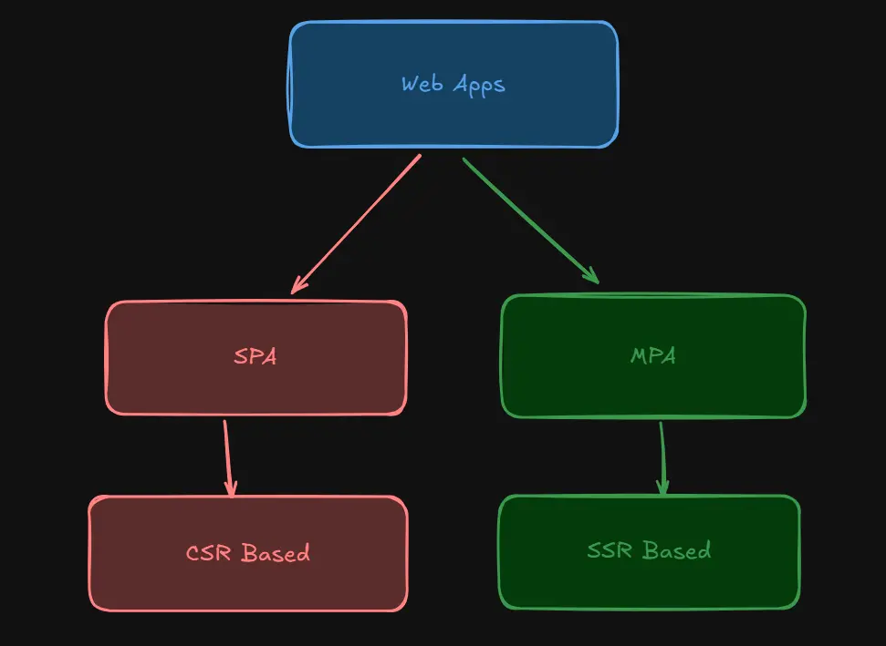
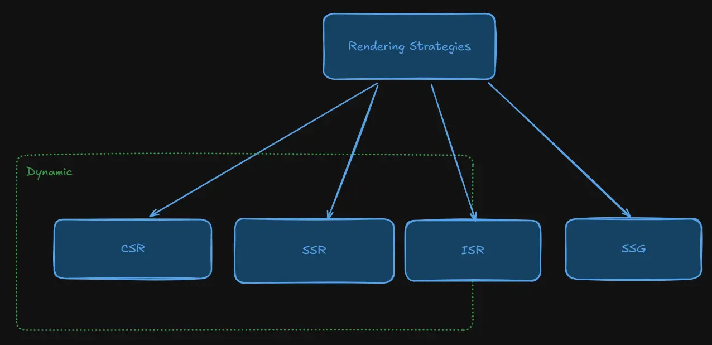
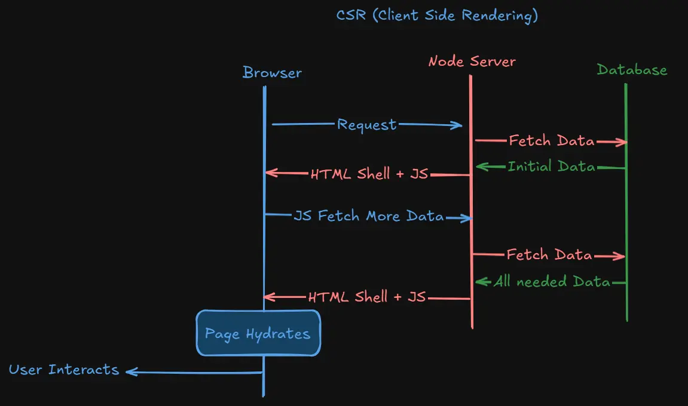
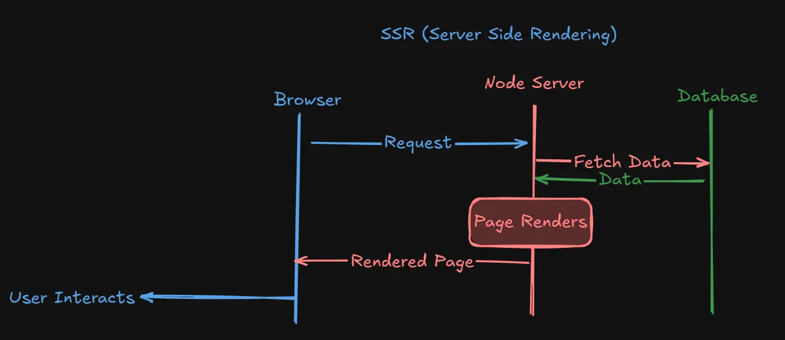
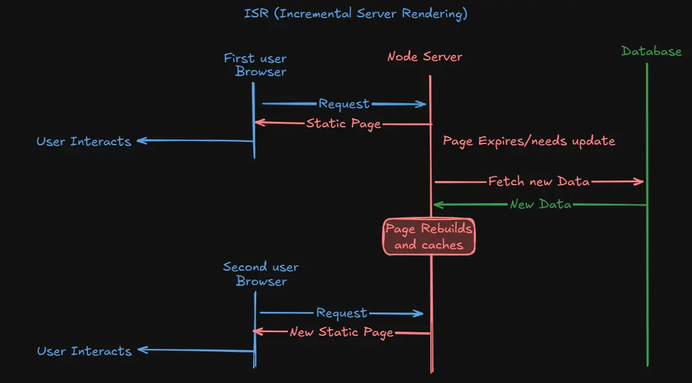

In a [recent article about the modern ways to create a React app](https://blog.maiko26.tn/tech/create-react-app-deprecated-what-are-the-modern-alternatives), I discussed different frameworks and how to use each optimally based on the chosen web architecture—each with its own pros, cons, and use cases.

Today, I want to break it down further. People often conflate **Web Architectures** and **Rendering Strategies**. Web Architectures refer to the broad structure of how an app behaves—primarily how routing is handled—while Rendering Strategies are about how the content of each page is generated and delivered.

The two most common architectures are:

- **MPA (Multi-Page Application):** The traditional way of creating websites where each page is rendered on the server. This approach is common in PHP-based systems (like WordPress), Ruby on Rails, and even modern meta-frameworks like Next.js when configured to work as an MPA.
- **SPA (Single Page Application):** A modern approach that emerged with the JavaScript framework wave from 2010 onwards. In an SPA, the client downloads all the JavaScript needed for the application, and rendering happens on the client side for a seamless, native-like experience.

Now, what is the difference between these two architectures?

## Web Architectures

### SPA (Single Page Applications)

SPAs are often used interchangeably with CSR (Client-Side Rendering) because the client downloads the necessary JavaScript and handles most of the compute and rendering. This approach provides a seamless, native-like experience without the constant back-and-forth with the server. Frameworks like React, Angular, Vue, Solid, and Svelte are commonly used to build SPAs.

### MPA (Multi-Page Applications)

MPAs represent the traditional way of building web sites and apps, where the server is responsible for computing and rendering the content. Each time the user navigates, the server sends a fully rendered HTML page ready for interaction. This architecture is common in platforms like WordPress, Shopify, and even in modern meta-frameworks (e.g., Next.js, Astro, Solidstart, SvelteKit) when used in a traditional MPA mode.

## Rendering Strategies

There are four popular rendering strategies in 2025—along with many hybrids and combinations—that you can use depending on your needs:

- **CSR (Client-Side Rendering)**
- **SSR (Server-Side Rendering)**
- **SSG (Static Site Generation)**
- **ISR (Incremental Static Regeneration)**

### CSR (Client-Side Rendering)

CSR works by sending the user a basic HTML shell along with JavaScript. Once the JS is executed, it fetches additional data to render the page. While this provides a highly interactive experience—making it great for social media apps and dashboards—it comes with a slow initial load and poor SEO since web crawlers only see the empty shell at first.

### SSR (Server-Side Rendering)

SSR generates the full HTML page on each request. The server fetches data from the database, renders the page, and sends it to the user. This results in a fast initial load and excellent SEO since web crawlers receive fully rendered pages. With advancements like pre-fetching and caching in modern meta-frameworks, SSR can offer performance close to that of CSR while still providing dynamic content.

### SSG (Static Site Generation)

SSG builds your pages at build time, generating static HTML files that are ready to serve instantly. This method offers outstanding performance and SEO benefits since the content is already rendered. However, because the pages are static, they only update when you rebuild and redeploy the site—a good choice for content-driven websites that change infrequently.

### ISR (Incremental Static Regeneration)

ISR is a hybrid approach that combines the speed of SSG with the dynamism of SSR. On the first request, the server sends a cached, pre-built page. In the background, it checks if the content has changed (or if a set time has expired) and, if so, rebuilds the page. This ensures subsequent users receive updated content with the performance benefits of static pages. Tools like Next.js and Astro support ISR, as do other frameworks like SvelteKit and SolidStart.

## Conclusion

Understanding the distinction between **Web Architectures** (SPA vs. MPA) and **Rendering Strategies** (CSR, SSR, SSG, ISR) is key to choosing the right approach for your project. Each offers unique advantages depending on your needs—whether you prioritize interactivity, SEO, performance, or dynamic content updates.
